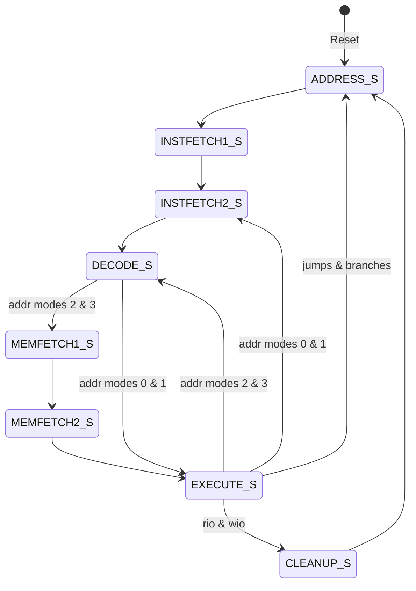
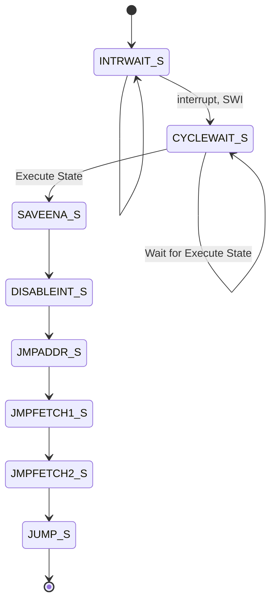

# Craig's CPU

This is a simple CPU architecture that I used to verify that I understand how to use FPGAs, VHDL, and write a CPU.  This is my largest project to date.

## Specifications

| Clock Speed.                     |            |
| -------------------------------- | ---------- |
| Word size                        | 32 Bits    |
| Memory                           | 4096 Words |
| Average Instructions per second. | 16.6KIPS   |
| Cache                            | 0          |
| Cores                            | 1          |
| Registers                        | 16         |
| Interrupt                        | 32         |
| IO Addresses                     | 256        |


## Hardware

- Computer (Laptop) - 13th Gen i9-13900 2.20GHz, 32 GB

- Arty-S7 Rev-E with AMD XC7S50-1CSGA324C FPGA

  | Description  | Specification                  |
  | ------------ | ------------------------------ |
  | Logic Slices | 8,150                          |
  | 6-Input LUT  | 32,200                         |
  | Flip-Flops   | 65,200                         |
  | Block RAM    | 337.5 KB                       |
  | DPS          | 120                            |
  | Clock        | 100 MHz / 12 MHz (Max 450 MHz) |


* Connectivity and IO

  | Input/Output     | Specification                    |
  | ---------------- | -------------------------------- |
  | USB              | USB-UART USB-JTAG Programmer     |
  | Pmod Connectors  | 4                                |
  | Other Connectors | Arduino/chipKIT shield connector |
  | Switches         | 4 slide switches                 |
  | Buttons          | 4 Push buttons                   |
  | LEDs             | 4 LEDs, 2 RGB LEDs               |

## Software

- Microsoft Windows 11 Pro
- AMD Vivado v2023.2 (64-bit)
  - VHDL 2K
- Visual Studio Code
  - Extensions
    - VHDL
    - CustomAsm
- [CustomAsm](https://github.com/hlorenzi/customasm) 

## IPs

- Block Memory Generator v8.4

  - Interface Type: Native

  - Memory Type :True Dual Port RAM

  - Port A/B

    - Write Width - 32 bits
    - Read Width - 32 bits
    - Write Depth - 4096
    - Read Depth - 4096
    - Primitive Output Register

  - Other Options

    - Load Init File - Program.coe
    - Fill Remaining Memory Locations - A5

  - Read Latency - 2 cycles

    

## Specifictions

| Clock Speed                     |      |
| ------------------------------- | ---- |
| 32 Bit words                    |      |
| 4096 Word Memory                |      |
| Average Instructions per second |      |
| Cache                           |      |
| No. Cores                       |      |
| No. Registers                   |      |
| No. Interrupt                   |      |
| No. IO Addresses                |      |
|                                 |      |


## Principles

1. Instructions are the same length.
1. Memory is accessed in the same length as Instructions.  Word and Instruction length is 32 bits.
1. All instructions contain the same fields.  Some fields are not used for some instructions.
1. Each instruction contains 2 register fields.
1. Only the store commands will update memory.
1. There will be 16 registers.
1. No status flags are required.  Branches compare 2 registers.

## Instruction Format

|              | Opcode | Flag         | Access <br />(Memory)                                        | Register 1                | Register 2     | Immediate / <br />Address |
| ------------ | ------ | ------------ | ------------------------------------------------------------ | ------------------------- | -------------- | ------------------------- |
| Bit Position | 31-27  | 26           | 25-24                                                        | 23-20                     | 19-16          | 15-0                      |
| Number Bits  | 5      | 1            | 2                                                            | 4                         | 4              | 16                        |
| Description  |        | Hi/Low / Not | 0 = Register / Register<br />1 = Immediate<br />2 = Absolute<br />3 = Indexed | Destination / Accumulator | Source / Index |                           |

***Recommendation: R0 not be used as a user register.***

### Opcode

There are 5 bits for the opcode.  

### Flag

Load instruction - High 1/2 word = 1, Low 1/2 Word = 0

1 = NOT for the following instructions:

- Branch
- And
- Nand
- Or
- Nor
- Xor
- Xnor

### Access (Memory)

Register/Register - The first register is an destination/accumulator.  The second register is a source/memory index.

Immediate - This is 16-bit data that can be used to load or change the accumulator.

Absolute - This gets the address from the 16-bit Immediate part of the instruction.

Index - This gets the address from the addition of the 2nd register and the Immediate part of the instruction.

### Register 1

The first Register is the destination for load, source for the store, and accumulator for Add, Subtract, And, etc.

### Register 2

The Second Register is the source or index.  For Operations (Add, Subtract, Add, etc.) this can be added to the Immediate value.  If Register 0 is used then nothing will be used in the operation.  For Branch instruction the second Register is Register 0 this will cause Register 1 to be compared with 0 (branch zero, branch not zero, branch negative and branch positive, etc).

### Immediate

The immediate part of the instruction is limited to 16 bits. It can only load the lower half of the word.  Setting the flag will cause the load to work on the higher bits.  The Immediate is currently an unsigned integer.

## Architecture / Design

The CPU  contains the Finite State Model for the instruction cycle.  All of the processes are located in other modules.  The Program Counter module includes the process to update the program counter and instruction address.  The Memory Access module includes updating the instruction's memory argument (data).  The Arithmetic Logic Unit (ALU) updates the register with the instruction operation. The IO Processing performs operations which sets the address, read/write enable, and writes data to the computer.  The Wait / Timer module the wait pauses the instructions from executing and sleep will allow the processor to continue, and call an interrupt when the time expires.  The Interrupt process will start when an interrupt happens then it stores the program counter and mask to the stack and calls the interrupt.

The Memory IP is maintained external to the CPU (currently inside the test Computer Module).   Nothing prevents Port A and Port B from being different Memory Module.

### CPU

The operation cycles are in the following order: ADDRESS, INSTFETCH1, INSTFETCH2, DECODE, MEMFETCH1, MEMFETCH2, EXECUTE, and CLEANUP.  Some instructions do not use all of the cycles.  Example: the MEMFETCH1only is used during Read / Write IO operations, other operations completely skipped this cycle.  Another exception MEMFETCH1 and MEMFETCH2 cycles are skipped when the operation is not a Memory read (Access / Memory operations 2 and 3).

During each cycle, the Access (Memory) value is selected (Case statement) and then the Opcode is selected (Case).  This is opposite to the normal method of CPU operation (Opcode first, Memory second).

#### Wire Assignments (outputs)

| Signal    | Description                                                  |
| --------- | ------------------------------------------------------------ |
| IO_ADDR   | Address of the IO peripheral.                                |
| IOW_DATA  | Data to be written to the peripheral.                        |
| IOW_ENA   | Flag indicating the transfer of data from CPU to peripheral. |
| IOR_ENA   | Flag indicating the data needs to be transferred from peripheral to CPU. |
| MEM_ENA   | Enable at Address and disable during the Decode for branches. |
| MEM_WEA   | Always 0 (Read Only)                                         |
| MEM_ADDRA | The address to Read or Write memory.                         |
| MEM_ENB   | The Instruction Memory enabled.                              |
| MEM_WEB   | The Instruction Memory Read/Write.                           |
| MEM_ADDRB | The Instruction address to Read or Write memory.             |
| MEM_DINB  | The Instruction input data.                                  |

#### Used Wires (inputs):

| Signal    | Description                               |
| --------- | ----------------------------------------- |
| IOR_DATA  | Data from the peripheral device.          |
| IO_STATUS | The IO status from the peripheral device. |
| INTERRUPT | The Interrupt vector                      |
| MEM_DINB  | Instruction operation.                    |
| MEM_DINB  | The Instruction input data.               |

#### Internal Wires:

| Signal                              | Description                                                  |
| ----------------------------------- | ------------------------------------------------------------ |
| Program Counter                     | Program counter (address) of the current executed statement. |
| fsm_inst_cycle_p / fsm_inst_cycle_n | Instruction finite state model (See below)                   |
| flag/ffflag                         | Multiple use flag (e.g., negative logic)                     |
| opcode/ffopcode                     | Instruction operation                                        |
| memop/ffmemop                       | Memory access operation.                                     |
| regop1/iregop1/ffiregop1            | Instruction identified first register.                       |
| ireg1value                          | Value of the Register pointed to by instruction.             |
| regop2/iregop2/ffiregop2            | Instruction identified second register.                      |
| ireg2value                          | Value of the Register pointed to by instruction.             |
| immop/ffimmop                       | Immediate value from the instruction.                        |
| cpuRegs                             | The fast CPU registers.                                      |
| fsm_interrupt_cycle_p               | Interrupt finite state model                                 |
| interruptRun                        | Flag indicating that the interrupt is running.               |
| interruptNum                        | Interrupt number being processed (1-31)                      |
| interruptMask                       | The Interrupt enable mask (1 is enabled).                    |
| interruptSpNum                      | The stack pointer register.                                  |
| interruptSpAddrValue                | The value of the stack pointer at the starting of the interrupt. |
| waitRun                             | This is active when it is in a wait state.                   |
| waitAlarm                           | The alarm happens when the wait timer is completed.          |
| waitCancel                          | This cancels the wait state.                                 |
| timerAlarm                          | This alarm happens when the timer is completed.              |
| timerInt                            | The interrupt number is to be processed when the timer alarm goes off. |

#### Instruction State Diagram

| Cycle      | Description                                                  |
| ---------- | ------------------------------------------------------------ |
| ADDRESS    | Sets the instruction address.<br />Start interrupt processing |
| INSTFETCH1 | Wait for instruction data.                                   |
| INSTFETCH2 | Wait for instruction data.                                   |
| DECODE     | Instruction Data is available and the Instruction is separated into different fields.<br/>The main purpose is to get the values required to perform the operations.  For Memory operations 0 (Register/Register), the register values are obtained.  For Memory Operation 1 the Registers and the Immediate values.  For Memory Operation 2, the Immediate value is used as the Memory address.  For Memory Operation 3, the Register and the Immediate values are added and used as the Memory address. |
| MEMFETCH1  | Wait for Access (Memory) types 2 and 3.<br />The Return from Interrupt (RTI) operation reads the stack for the Interrupt Mask. |
| MEMFETCH2  | Wait for Read for Access (Memory) types 2 and 3.             |
| EXECUTE    | Perform the operations.                                      |
| CLEANUP    | Perform additional items after Execute.  Read and Write operations are the only operations that use this cycle state to reset the enable flag. |




------
### Program Counter

This handles the program counter (PC) and memory access for obtaining the instruction.  This sets the address of the next instruction (Port A memory access).   This is the fetch.

#### Instructions
* oJMP - Unconditional Jump
* oJSR - Jump and store PC (Jump to Subroutine)
* oRTN - Return from JSR (Return from Subroutine)
* oRTI - Return from Interrupt
* oBE - Branch Equal, Zero, Not Equal, or Not Zero
* oBLT - Branch Less Than, Negative, Greater than  and Equal, Not Negative
* oBGT - Branch Greater Than, Positive, Less than  and Equal, Not Positive

#### Wire Assignments (outputs)

| Signal          | Description                                                  |
| --------------- | ------------------------------------------------------------ |
| MEM_ADDRA       | The address to Read or Write memory.                         |
| MEM_ENA         | Enable at Address and disable during the Decode for branches. |
| MEM_WEA         | Always 0 (Read Only)                                         |
| Program Counter | Program counter (address) of the current executed statement. |

Note:  Actually setting MEM_DOUTA (writting memory) is not part of this process.
Note: The Program Counter is a Combinational output of the internal ProgCounterLocal.

#### Used Wires (inputs):

| Signal                | Description                                                  |
| --------------------- | ------------------------------------------------------------ |
| INSTRUCTION           | Current Fetched Instruction                                  |
| cpuRegs               | CPU Fast Registers                                           |
| fsm_inst_cycle_p      | Process States:                                              |
|                       | RESET_STATE_S  - Reset the CPU.                              |
|                       | ADDRESS_S    - Setting the address from the program counter.  This sets the clears the memory enable. |
|                       | DECODE_S     - Instruction Decode and identify operands.  Sets up the Memory addresses and write data. |
|                       | EXECUTE_S    - Execute the instruction.  To process interrupts, store registers/data. |
| fsm_interrupt_cycle_p | Process States:                                              |
|                       | JUMP_S      - Changes the program counter to address from the interrupt vector. |

#### Internal Wires:

| Signal           | Description                                                  |
| ---------------- | ------------------------------------------------------------ |
| opcode/ffopcode  | Instruction operation                                        |
| ffflag           | Multiple use flag to modify the instruction operation (e.g., negative logic) |
| ffmemop          | Memory access operation (Reg/Reg, Immediate, absolute and indexed). |
| ffiregop1        | Instruction identified first register.                       |
| ffiregop2        | Instruction identified second register.                      |
| ireg1value       | Register value of the first instruction register.            |
| ireg2value       | Register value of the second instruction register.           |
| ffimmop          | Immediate value from the instruction.                        |
| ProgCounterLocal | Local Program Counter used for calculations.                 |

Note: During the Decode state, the MEM_DOUTA is separated into opcode, flag, memop, regop1, regop2, and immop combinational wires.  The ff* are clocked flip-flop registers that store the values to be used in other states.

------
### Memory Access

This handles the memory access for the operand, stack, and etc. memory.  This used the Port B memory access.

#### Instructions

 * oSTR - Store memory to register
 * oRWIO - Read and store memory.

#### Wire Assignments (outputs)

| Signal            | Description                                                  |
| ----------------- | ------------------------------------------------------------ |
| MEM_ENB           | The Instruction Memory enabled. |
| MEM_WEB           | The Instruction Memory Read/Write. |
| MEM_ADDRB         | The Instruction address to Read or Write memory. |
| MEM_DINB          | The Instruction input data. |

Note:   Actually setting MEM_DOUTB (writting memory) is not part of this process.
            But setting the address to write memory is being set.
            This does not used 3-state addresses, could make use of it in the future.


#### Used Wires (Inputs)

| Signal            | Description                                                  |
| ----------------- | ------------------------------------------------------------ |
| INSTRUCTION       | Instruction operation|
| cpuRegs           | The fast CPU registers.|
| fsm_inst_cycle_p| Process States: |
| | RESET_STATE_S - Reset the CPU. |
| | ADDRESS_S - Setting the address from the program counter.  This sets clears the memory enable. |
| | DECODE_S - Instruction Decode and identify operands.  Sets up the Memory addresses and writes data. |
| | MEMFETCH1_S - Waits to read (MEM_DOUTB) because of the memory legacy and latches. This is  use to pop interrupt PC and mask. |
| | MEMFETCH2_S - Waits to read (MEM_DOUTB) because of the memory legacy and latches |
| | EXECUTE_S - Execute the instruction. To process interrupts, and store registers/data. |
| | CLEANUP_S - Clean up data after execute state. |
| fsm_interrupt_cycle_p|Process States:|
| |SAVEENA_S (State 2)     - Saves the Interrupt Enable Mask.|
| |DISABLEINT_S (State 3)  - Disable all Interrupts.|
| |JMPADDR_S (State 4)     - Get the Interrupt Handler from address vector.|
| |JMPFETCH2_S (State 6)   - Memory Read Latency|
| interruptRun           | Flag indicating that the interrupt is running.|
| interruptNum           | Interrupt number being processed (1-31)|
| interruptMask          | The Interrupt enable mask (1 is enabled).|
| interruptSpAddrValue   | The value of the stack pointer at the starting of the interrupt.|
| ProgramCounter         | Program counter (address) of the current executed statement.|

#### Internal Wires:

| Signal            | Description                                                  |
| ----------------- | ------------------------------------------------------------ |
|  flag/ffflag             | Multiple use flag (e.g., negative logic)|
|  opcode/ffopcode         | Instruction operation|
|  memop/ffmemop           | Memory access operation.|
|  regop1/iregop1/ffiregop1| Instruction identified first register.|
|  ireg1value              | Value of the Register pointed to by instruction.|
|  regop2/iregop2/ffiregop2| Instruction identified second register.|
|  ireg2value              | Value of the Register pointed to by instruction.|
|  immop/ffimmop           | Immediate value from the instruction.|

------

### Arithmetic Logic Unit (ALU)

This handles the updating and operating on the register and is also known as the Arithmetic Logic Unit (ALU).

#### Instructions

 * oLD - Move Register contents, load memory to register
 * oRTN - Return from JSR (Return from Subroutine)
 * oRTI - Return from InterruptoRTN
 * oADD - Add registers, immediate, or memory 
 * oSUB - Subtract registers, immediate, or memory 
 * oAND - And or Nand registers, immediate, or memory
 * oOR - Or or Nor registers, immediate, or memory
 * oXOR - Xor or Xnor registers, immediate, or memory
 * oSHL - Shift left registers, immediate, or memory
 * oSHR - Shift right registers, immediate, or memory
 * oJSR - Jump and store PC (Jump to Subroutine)
 * oRWIO - Load and write to IO.
 * oPUSHPOP - Push or Pop from memory

#### Wire Assignments (outputs)
| Signal            | Description                                                  |
| ----------------- | ------------------------------------------------------------ |
| cpuRegs         | The fast CPU registers.

#### Used Wires (Inputs)
| Signal            | Description                                                  |
| ----------------- | ------------------------------------------------------------ |
|INSTRUCTION     | Instruction operation
|MEM_ARG         | The current memory argument from decode.
|fsm_inst_cycle_p | Process States:
| |       RESET_STATE_S           - Reset the CPU.
| |       EXECUTE_S               - Execute the instruction.  To process interrupts, store registers/data.
|  |      CLEANUP_S               - Clean up data after execute.
|fsm_interrupt_cycle_p | Process States:
|  |      SAVEENA_S (State 2)     - Saves the Interrupt Enable Mask.
|  |      JMPADDR_S (State 4)     - Get the Interrupt Handler from address vector.
|interruptSPNum
|IOR_DATA           | Data from the peripheral device.
|IO_STATUS          | The IO status from the peripheral device.
|ireg1value         | Value of the Register pointed to by instruction.
|ffiregop2          | Instruction identified second register.
|ireg2value         | Value of the Register pointed to by instruction.
|interruptSpAddrValue    

#### Internal Wires:
| Signal            | Description                                                  |
| ----------------- | ------------------------------------------------------------ |
| ffopcode          | Instruction operation
| ffflag            | Multiple use flag (e.g., negative logic)
| ffmemop           | Memory access operation.
| ffiregop1         | Instruction identified first register.
| ffiregop2         | Instruction identified second register.
| ffimmop           | Immediate value from the instruction.

----

### IO Processing

 This handles the address, data, and statuses for IO.

#### Instructions

 * oRWIO - Interface with the IO signals.

#### Wire Assignments (outputs)

| Signal   | Description                                                  |
| -------- | ------------------------------------------------------------ |
| IO_ADDR  | Address of the IO peripheral.                                |
| IOW_DATA | Data to be written to the peripheral.                        |
| IOW_ENA  | Flag indicating the transfer of data from CPU to peripheral. |
| IOR_ENA  | Flag indicating the data needs to be transferred from peripheral to CPU. |

Note:  Interrupt driven peripheral should use the Interrupts Processing (No special purpose IO interrupts).
Note:  Reading the IO (IOR_DATA) is not performed in this process. it is used by other processes.

#### Used Wires (Inputs)

| Signal           | Description                                                  |
| ---------------- | ------------------------------------------------------------ |
| INSTRUCTION      | Instruction operation                                        |
| MEM_ARG          | The current memory argument from decode.                     |
| fsm_inst_cycle_p | Process States:                                              |
|                  | RESET_STATE_S           - Reset the CPU.                     |
|                  | DECODE_S                    - Instruction Decode and identify operands. |
|                  | EXECUTE_S               - Execute the instruction.  To process interrupts, store registers/data. |
|                  | CLEANUP_S               - Clean up data after execute.       |
| cpuRegs          | The fast CPU registers.                                      |

#### Internal Wires:

| Signal                   | Description                                      |
| ------------------------ | ------------------------------------------------ |
| flag/ffflag              | Multiple use flag (e.g., negative logic)         |
| opcode/ffopcode          | Instruction operation                            |
| memop/ffmemop            | Memory access operation.                         |
| regop1/iregop1/ffiregop1 | Instruction identified first register.           |
| ireg1value               | Value of the Register pointed to by instruction. |
| regop2/iregop2/ffiregop2 | Instruction identified second register.          |
| ireg2value               | Value of the Register pointed to by instruction. |
| immop/ffimmop            | Immediate value from the instruction.            |

### Wait / Timer

#### Instructions

 * oWAIT - Wait, Timer or Cancel.

This processes the wait instruction which pauses execution and sleep which continues the execution, but when the alarm happens it will call a interrupt.  The wait and sleep timers count the clock.

#### Wire Assignments (outputs)

| Signal     | Description                                                  |
| ---------- | ------------------------------------------------------------ |
| waitAlarm  | The alarm happens when the wait timer is completed.          |
| waitRun    | This is active when it is in a wait state.                   |
| waitCancel | This cancels the wait state.                                 |
| timerAlarm | This alarm happens when the timer is completed.              |
| timerInt   | The interrupt number is to be processed when the timer alarm goes off. |

Note:  Interrupt driven peripheral should use the Interrupts Processing (No special purpose IO interrupts).
Note:  Reading the IO (IOR_DATA) is not performed in this process. it is used by other processes.

#### Used Wires (Inputs)

| Signal           | Description                                                  |
| ---------------- | ------------------------------------------------------------ |
| INSTRUCTION      | Instruction operation                                        |
| fsm_inst_cycle_p | Process States:                                              |
|                  | RESET_STATE_S           - Reset the CPU.                     |
|                  | DECODE_S                    - Instruction Decode and identify operands. |
|                  | EXECUTE_S               - Execute the instruction.  To process interrupts, store registers/data. |
| cpuRegs          | The fast CPU registers.                                      |

#### Internal Wires:

| Signal                   | Description                                              |
| ------------------------ | -------------------------------------------------------- |
| flag/ffflag              | Multiple use flag (e.g., negative logic)                 |
| opcode/ffopcode          | Instruction operation                                    |
| memop/ffmemop            | Memory access operation.                                 |
| regop1/iregop1/ffiregop1 | Instruction identified first register.                   |
| ireg1value               | Value of the Register pointed to by instruction.         |
| regop2/iregop2/ffiregop2 | Instruction identified second register.                  |
| ireg2value               | Value of the Register pointed to by instruction.         |
| immop/ffimmop            | Immediate value from the instruction.                    |
| waitReg                  | This is the wait register.                               |
| waitTime                 | This is the wait timer.                                  |
| waitCount                | This is the counter for the timer.                       |
| waitResolution           | This is the resolution of the wait timer.                |
| waitResCounter           | This counter will count the number of resolution values. |
| waitRunLocal             | This is the local value of the wait run.                 |
| waitCancelLocal          | This is the local value of the cancel.                   |
| timerRun                 | This is active when the timer is running.                |
| timerReg                 | This is the timer register number.                       |
| timerTime                | This is the wait timer.                                  |
| timerCount               | This is the counter for the timer.                       |
| timerResolution          | This is the resolution of the wait timer.                |
| timerResCounter          | This counter will count the number of resolution values. |

-----
### Interrupts
This handles the interrupt put the Mask and program counter
             on the stack and calls the interrupt handler.
            The maintains it own finite state machine (FSM).
#### Wire Assignments (outputs)
| Signal            | Description                                                  |
| ----------------- | ------------------------------------------------------------ |
|fsm_interrupt_cycle_p |
|  |  INTRWAIT_S (State 0)    - Wait for Interrupt
|  |  CYCLEWAIT_S (State 1)   - Wait for Instruction Cycle to complete.
|  |  SAVEENA_S (State 2)     - Saves the Interrupt Enable Mask.
|  |  DISABLEINT_S (State 3)  - Disable all Interrupts.
|  |  JMPADDR_S (State 4)     - Get the Interrupt Handler from address vector.
|  |  JMPFETCH1_S (State 5)   - Memory Read Latency 
|  |  JMPFETCH2_S (State 6)   - Memory Read Latency 
|  |  JUMP_S (State 7)        - Start the Instruction Cycle with Interrupt Handler.
|  |  DONE_S (State 8)        - Complete the Interrupt processing.
|interruptRun            | Flag indicating that the interrupt is running.
|interruptNum            | Interrupt number being processed (1-31)
|interruptMask           | The Interrupt enable mask (1 is enabled).
|interruptSpNum          | The stack pointer register.
|interruptSpAddrValue    | The value of the stack pointer at the starting of the interrupt.

Note:   Limitations 1) The interrupt is read when instruction in execute state.

#### Used Wires (Inputs)
| Signal            | Description                                                  |
| ----------------- | ------------------------------------------------------------ |
| INSTRUCTION         | Current Fetched Instruction
| cpuRegs             | CPU Registers
| fsm_inst_cycle_p | Process States:
|  |       RESET_STATE_S   - Reset the CPU.
|  |       DECODE_S        - Instruction Decode and identify operands.
|  |       EXECUTE_S       - Execute the instruction.
|  |       CLEANUP_S       - Clean up data after execute.
| MEM_ARG             | The current memory argument from decode.
| INTERRUPT           | The Interrupt vector
| timerAlarm          | Completion of the timer alarm.
| timerInt            | The interrupt number (1-31)
#### Internal Wires:
| Signal            | Description                                                  |
| ----------------- | ------------------------------------------------------------ |
| opcode/ffopcode         | Instruction operation
| ffflag                  | Multiple use flag (e.g., negative logic)
| memop/ffmemop           | Memory access operation.
| ffiregop1               | Instruction identified first register.
| ireg1value              | Value of the Register pointed to by instruction.
| ireg2value              | Value of the Register pointed to by instruction.
| ffimmop                 | Immediate value from the instruction.
| fsm_interrupt_cycle_p_local
|                         | Local value of the current state (set and used).
| fsm_interrupt_cycle_n   | Next interrupt state.
| interBitNum             | Interrupt bit number (interrupt number)
| interruptMaskLocal      | Local value of the Mask (set and used).
| interruptSpNumLocal     | Local value of the interrupt stack register number (set and used).

#### Interrupt State Diagram

| Cycle      | Description                                                  |
| ---------- | ------------------------------------------------------------ |
|            | Interrupt Processing                                         |
| SAVEENA    | IntEna → dinB  <br />reg(InterSP) → reg(InterSP) – 1         |
| DISABLEINT | ’0’ → IntEna(interNum) <br />reg(InterSP) → addrB <br />PC → dinB |
| JMPADDR    | reg(InterSP) → reg(InterSP) – 1 <br />InterNum → addrB       |
| JMPFETCH1  | Wait                                                         |
| JMPFETCH2  | Wait                                                         |
| JUMP       | DoutB → PC                                                   |


---------------------------------------------------------------------------


## Instructions

| Opcode                                                       | Bits    | Flag              | Address #0 <br /><u>Register / Register</u>                  | Address #1 <br /><u>Immediate</u>                            | Address #2 <br /><u>Absolute Memory</u> | Address #3 <br /><u>Index Memory</u> |
| ------------------------------------------------------------ | ------- | ----------------- | ------------------------------------------------------------ | ------------------------------------------------------------ | --------------------------------------- | ------------------------------------ |
| `NOOP`                                                       | `00000` | NA                | NA                                                           | NA                                                           | NA                                      | NA                                   |
| `ld` (Load)                                                  | `00010` | High Bits (16-31) | $R2 → R1$                                                    | $imm → R1$                                                   | $mem[imm] → R1$                         | $mem[r2+imm] → R1$                   |
| `st` (Store)                                                 | `00100` | NA                | NA                                                           | NA                                                           | $R1 → mem[imm]$                         | $R1 → mem[r2+imm]$                   |
| `jmp` (Jump)                                                 | `00110` | NA                | $R1 → PC$                                                    | $imm → PC$                                                   | $mem[imm] → PC$                         | $mem[r2 + mem] → PC$                 |
| `jsr` (Jump Subroutine)[^1]                                  | `01000` | NA                | $PC+1 → mem[R1]\\R1-1 → R1\\R2 → PC$                         | $PC+1 → mem[R1]\\R1-1 → R1\\imm → PC$                        | NA                                      | NA                                   |
| `rtn` (Return)[^1]                                           | `01010` | NA                | $R1+1 → R1\\mem(R1) → PC$                                    | NA                                                           | NA                                      | NA                                   |
| `be`<br />`bne` (not flag)[^2] <br />`bz` (R2=0)<br />`bnz` (R2=0, Flag=1)[^3] | `01100` | Not               | NA                                                           | $imm → PC$                                                   | $mem(imm) → PC$                         | NA                                   |
| `bl`<br />`bge` (not flag)[^4] <br />`bn` (R2=0)[^5]         | `01110` | Not               | NA                                                           | $imm → PC$                                                   | $mem(imm) → PC$                         | NA                                   |
| `bg`<br />`ble` (not flag)[^6]<br />`bp` (R2=0)[^7]          | `10000` | Not               | NA                                                           | $imm → PC$                                                   | $mem(imm) → PC$                         | NA                                   |
| `push`[^1]                                                   | `10010` | 0                 | $R2 → mem(R1)\\R1-1 → R1$                                    | $imm → mem(R1)\\R1-1 → R1$                                   | NA[^8]                                  | NA[^8]                               |
| `pop`[^1]                                                    | `10010` | 1                 | $R1+1 → R1\\mem(R1) → R2$                                    | NA                                                           | NA[^8]                                  | NA[^8]                               |
| `wait`[^13]                                                  | `10101` | 0                 |                                                              | $R1 --  Counter,\\imm→ resolution\\'1' → waitEna$            |                                         |                                      |
| `timer`[^14]                                                 | `10101` | 0                 |                                                              | $R1 -- Counter,\\ R2 -> TimerInt\\imm->resolution\\'1' → TimeeFlag$ |                                         |                                      |
| cancel                                                       | 10101   | 1                 | $if (R1 is Wait Register) then\\'0' → waitFlag\\if (R1 is Timer Register) then\\'0' → timerFlag$ |                                                              |                                         |                                      |
| `rio` (Read IO)                                              | `10110` | 0                 | $R2 → IOAddr,\\IOData →  R1$                                 | $imm → IOAddr\\IOData → R1$                                  | $R2 → IOAddr\\IOData → mem(imm)$        | $R1 → IOAddr\\IOData → mem(r2+imm)$  |
| `wio` (Write IO)                                             | `10110` | 1                 | $R2 → IOAddr\\R1 → IOData$                                   | $imm → IOAddr\\R1 → IOData$                                  | $R2 → IOAddr\\mem(imm) → IOData$        | $R1 → IOAddr\\mem(r2+imm) → IOData$  |
| `rsio (Read Status)`                                         | `11000` | 0                 | $R2 → IOAddr\\Status → R1$                                   | $imm → IOAddr\\Status → R1$                                  |                                         |                                      |
| `wsio (Write Status)`                                        | `11000` | 1                 | $R2 → IOAddr\\ Status → R1$                                  | $imm → IOAddr\\Status → R1$                                  |                                         |                                      |
| `rti` (Return from Interrupt)[^11]                           | `11010` | NA                | NA                                                           | NA                                                           | NA                                      | NA                                   |
| `swi` (Software Interrupt)[^11]                              | `11100` | NA                | $'1' → IRProcFlag\\R1 → InterNum$                            | $'1' → IRProcFlag\\imm  → InterNum$                          | Not Tested                              | NA                                   |
| `iena` (Interrupt enable mask)[^11]: [^12]:                  | `11110` | NA                | $R1 → IRSP,\\R2 → InterEna$                                  | $R1 → IRSP,\\imm → InterEna$                                 | $R1 → IRSP\\mem(imm) → \\InterEna$      | NA                                   |
| `add`                                                        | `00001` | NA                | $R1 + R2 → R1$                                               | $R1 + R2 + imm → R1 \\ R2 == 0 : R1 + \\imm → R1$            | $R1 + mem(imm) → R1$                    | $R1 + mem(r2+imm)$ → R1              |
| `sub`                                                        | `00011` | NA                | $R1 - R2 → R1$                                               | $R1 - R2 - imm → R1\\R2 == 0 : R1 -\\ imm → R1$              | $R1 - mem(imm) → R1$                    | $R1 - mem(r2+imm) → R1$              |
| `and`<br />`nand` (Flag = 1)                                 | `00101` | not               | $R1 ∧ R2 → R1$                                               | $R1 ∧ R2 ∧ imm → R1\\R2 = 0  : R1 ∧ \\imm → R1$              | $R1 ∧ mem(imm) → R1$                    | $R1 ∧ mem(r2+imm) → R1$              |
| `or`<br />`nor` (Flag = 1)                                   | `00110` | not               | $R1 ∨ R2  → R1$                                              | $R1 ∨ R2 ∨ imm → R1\\R2 = 0  : R1 ∨ \\imm → R1$              | $R1 ∧ mem(imm) → R1$                    | $R1 ∨ mem(r2+imm) → R1$              |
| `xor`<br />`xnor` (Flag = 1)                                 | `01011` | not               | $R1 ⊕ R2  → R1$                                              | $R1⊕R2⊕imm→ R1\\R2=0:R1⊕\\imm→R1$                            | $R1 ⊕ mem(imm) → R1$                    | $R1 ⊕ mem(r2+imm) → R1$              |
| `sll` (Shift Left Logical)                                   | `01101` | NA                | $R1 << R2  → R1$                                             | $R1<<imm → R1\\R2 = 0  : R1<<\\imm → R1$                     | $R1<<mem(imm) → R1$                     | $R1<<mem(r2+imm) → R1$               |
| `srl`(Shift Right Logical)                                   | `01111` | NA                | $R1 >> R2 → R1$                                              | $R1 >> imm → R1\\R2 = 0  : R1 >> \\imm → R1$                 | $R1>>mem(imm) → R1$                     | $R1>>mem(r2+imm) → R1$               |

[^1]: R1 is the  Stack Pointer
[^2]: R2 <> 0: R1 = R2 R1<>R2 (Flag=1)
[^3]: R2 = 0: R1 = 0 / R1 <> 0 (Flag=1)
[^4]: R2 <> 0: R1 < R2 / R1>=R2 (Flag =1)
[^5]: R2 = 0: R1 < 0 / R1 >= 0 (Flag=1)
[^6]: R2 <> 0: R1 > R2 / R1<=R2 (Flag=1)
[^7]: R2 = 0: R1 > 0 / R1 <= 0 (Flag=1)
[^8]: Memory Type 2 and 3 (might be possible with additional cycles)
[^9]: Reserved.  
[^10]: Reserved.
[^11]:See Interrupt Section.
[^12]:Interrupt Stack Pointer register number is saved and used for hardware and software interrupt.
[^13]: R2 = 0: Wait statement
[^14]: R2<>0: Timer statement, R2 contains the interrupt handler number


### Instruction Matrix:

|      | 0         | 1    | 2    | 3    | 4    | 5    | 6    | 7    |
| ---- | --------- | ---- | ---- | ---- | ---- | ---- | ---- | ---- |
| 0    |           | <sub>`ld r1, r2`</sub> |      | <sub>`jmp r1`</sub> | <sub>`jsr r1, r2`</sub> | <sub>`rtn r1`</sub> |      |      |
| 1 |  | <sub>`ldl r1, imm`</sub> |      | <sub>`jmp imm`</sub> | <sub>`jsr imm`</sub> |      | <sub>`be r1, r2, imm<br />bz r1, imm`</sub> | <sub>`blt r1, r2, imm<br />bn r1, imm` </sub> |
| 2 |           | <sub>`ld r1, mem [addr]`</sub> | <sub>`st r1, mem [addr]`</sub> | <sub>`jmp mem [addr]`</sub> |      |      | <sub>`be r1, r2, mem [addr]<br />bz r1, mem [addr]`</sub> | <sub>`blt r1, r2, mem[addr] <br /> bn r1, mem[addr]`</sub> |
| 3 |           | <sub>`ld r1, r2, mem [addr]`</sub> | <sub>`st r1, r2, mem [addr]`</sub> | <sub>`jmp r2, mem [addr]`</sub> |      |      |      |      |
| 4 |           |      |      |      |      |      |      |      |
| 5 |           | <sub>`ldh r1, imm`</sub> |      |      |      |      | <sub>`bne r1, r2, imm<br />bnz r1, imm`</sub> | <sub>`bge r1, r2, imm<br />bl r1, r0, imm`</sub> |
| 6 |           |      |      |      |      |      | <sub>`bne r1, r2, mem [addr]<br />bnz r1, mem [addr]`</sub> | <sub>`bge r1, r2, mem[addr]<br />bl r1, r0, mem[addr]`</sub> |
| 7 |           |      |      |      |      |      |      |      |
| 8 | <sub>`add r1, r2`</sub> | <sub>`sub r1, r2`</sub> | <sub>`and r1, r2`</sub> | <sub>`or r1, r2`</sub> |      | <sub>`xor r1, r2`</sub> | <sub>`sll r1, r2`</sub> | <sub>`srl r1, r2`</sub> |
| 9 | <sub>`add r1, r2, imm<br />add r1, imm`</sub> | <sub>`sub r1, r2, imm<br />sub r1, imm`</sub> | <sub>`and r1, r2, imm<br />and r1, imm`</sub> | <sub>`or r1, r2, imm <br />or r1, imm`</sub> |      | <sub>`xor r1, r2, imm<br />xor r1, imm`</sub> | <sub>`sll r1, r2, imm<br />sll r1, imm`</sub> | <sub>`srl r1, r2, imm<br />srl r1, imm`</sub> |
| a | <sub>`add  r1, mem[addr]`</sub> | <sub>`sub r1, mem[addr]`</sub> | <sub>`and r1, mem[addr]`</sub> | <sub>`or r1, mem[addr]`</sub> |      | <sub>`xor r1, mem[addr]`</sub> | <sub>`sll r1, mem[addr]`</sub> | <sub>`srl r1, mem[addr]`</sub> |
| b | <sub>`add r1, r2, mem[addr]`</sub> | <sub>`sub r1, r2, mem[addr]`</sub> | <sub>`and r1, r2, mem[addr]`</sub> | <sub>`or r1, r2, mem[addr]`</sub> |      | <sub>`xor r1, r2, mem[addr]`</sub> | <sub>`sll r1, r2, mem[addr]`</sub> | <sub>`srl r1, r2, mem[addr]`</sub> |
| c |                                             |                                             | <sub>`nand r1, r2`</sub>                      | <sub>`nor r1, r2`</sub>                     |                       | <sub>`xnor r1, r2`</sub>                      |                                                           |                                                            |
| d    |                                             |                                             | <sub>`nand r1, r2, imm<br />nand r1, imm`</sub> | <sub>`nor r1, r2, imm<br />nor r1, imm`</sub> |                       | <sub>`xnor r1, r2, imm<br />xnor r1, imm`</sub> |                                                           |                                                            |
| e    |                                             |                                             | <sub>`nand r1, mem[addr]`</sub>               | <sub>`nor r1, mem[addr]`</sub>              |                       | <sub>`xnor r1, mem[addr]`</sub>               |                                                           |                                                            |
| f    |                                             |      | <sub>`nand r1, r2, mem[addr]`</sub> | <sub>`nor r1, r2, mem[addr]`</sub> |      | <sub>`xnor r1, r2, mem[addr]`</sub> |      |      |

|      | 8                                                 | 9              | a                                    | b                       | c              | d     | e               | f                    |
| ---- | ------------------------------------------------- | -------------- | ------------------------------------ | ----------------------- | -------------- | ----- | --------------- | -------------------- |
| 0    |                                                   | `push r1, r2`  |                                      | `rio r1, r2`            | `rsio r1, r2`  | `rti` | `swi r2`        | `iena r1, r2`        |
| 1    | `bgt r1, r2, imm<br />bp r1, imm`                 | `push r1, imm` | `wait r1, imm<br />time r1, r2, imm` | `roi r1, imm`           | `rsoi r1, imm` |       | `swi imm`       | `iena r1, imm`       |
| 2    | `bgt r1, r2, mem[addr]<br />bp r1, mem[addr]`     |                |                                      | `roi r1, mem[addr]`     |                |       | `swi mem[addr]` | `iena r1, mem[addr]` |
| 3    |                                                   |                |                                      | `roi r1, r2, mem[addr]` |                |       |                 |                      |
| 4    |                                                   | `pop r1, r2`   | `CANC r1`                            | `wio r1, r2`            | `wsio r1, r2`  |       |                 |                      |
| 5    | `ble r1, r2, imm<br />bg r1, r0, imm`             |                |                                      | `woi r1, imm`           | `wsoi r1, imm` |       |                 |                      |
| 6    | `ble r1, r2, mem[addr]<br />bg r1, r0, mem[addr]` |                |                                      | `woi r1, mem[addr]`     |                |       |                 |                      |
| 7    |                                                   |                |                                      | `woi r1, r2, mem[addr]` |                |       |                 |                      |
| 8    |                                                   |                |                                      |                         |                |       |                 |                      |
| 9    |                                                   |                |                                      |                         |                |       |                 |                      |
| a    |                                                   |                |                                      |                         |                |       |                 |                      |
| b    |                                                   |                |                                      |                         |                |       |                 |                      |
| c    |                                                   |                |                                      |                         |                |       |                 |                      |
| d    |                                                   |                |                                      |                         |                |       |                 |                      |
| e    |                                                   |                |                                      |                         |                |       |                 |                      |
| f    |                                                   |                |                                      |                         |                |       |                 |                      |

## Instruction Detail

Reduction of cycles will be achieved when the instruction is preloaded (sequentially processed instruction).

### Load 

Perform loads and store operations. The cycles are the maximum cycles for that instruction.  The Load Immediate will fill the register with 2 separate operations (Load High and Load Low).  The Load Immediate uses a Signed argument, and the Load High/Low uses unsigned.

| Assembly                | Addressing        | Code                                   | Clock Cycles | Operation                                        |
| ----------------------- | ----------------- | -------------------------------------- | ------------ | ------------------------------------------------ |
| ld r1, r2               | Register/Register | 10                                     | 5            | R2 → R1                                          |
| ldl r1, Imm             | Immediate (Low)   | 11                                     | 5            | Imm → R1[0:15]                                   |
| ldh r1, Imm             | Immediate (High)  | 15                                     | 5            | Imm → R1[16:31]                                  |
| ld r1, Imm              | Immediate         | 15 and 11<br />Performs two Operations | 10           | Imm[0:15] → R1[0:15]<br />Imm[16:31] → R1[16:31] |
| ld r1, mem[address]     | Absolute          | 12                                     | 7            | mem[address] → R1                                |
| ld r1, r2, mem[address] | Index             | 13                                     | 7            | mem[address+R2] → R1                             |

### Store

Store the contents of the register in memory.

| Assembly                | Addressing | Code | Clock Cycles | Operation            |
| ----------------------- | ---------- | ---- | ------------ | -------------------- |
| st r1, mem[address]     | Absolute   | 22   | 7            | R1 → mem[address]    |
| st r1, r2, mem[address] | Index      | 23   | 7            | R1 → mem[address+R2] |

### Jump

Unconditional jump to a new address.  The index addressing command supports Jump Tables.

| Assembly             | Addressing        | Code | Clock Cycles | Operation            |
| -------------------- | ----------------- | ---- | ------------ | -------------------- |
| jmp r1               | Register/Register | 30   | 5            | R1 → PC              |
| jmp Imm              | Immediate         | 31   | 5            | Imm[0:15] → PC       |
| jmp mem[address]     | Absolute          | 32   | 7            | mem[address] → PC    |
| jmp r2, mem[address] | Index             | 33   | 7            | mem[address+R2] → PC |

### Jump Subroutine 

The Jump to Subroutine stores the return address to the Stack which is pointed to by the first Register (Stack Pointer Register).

| Assembly   | Addressing        | Code | Clock Cycles | Operation                                       |
| ---------- | ----------------- | ---- | ------------ | ----------------------------------------------- |
| jsr r1, r2 | Register/Register | 40   | 5            | PC+1 → mem(R1)<br />R1-1 → R1<br />R2 → PC      |
| jsr imm    | Immediate         | 41   | 5            | PC+1 → mem(R1), <br />R1-1 → R1, <br />imm → PC |

### Return

The Return reads the return address from the Stack which is pointed to by the stack pointer register.

| Assembly | Addressing        | Code | Clock Cycles | Operation                    |
| -------- | ----------------- | ---- | ------------ | ---------------------------- |
| rtn r1   | Register/Register | 50   | 7            | R1+1→ R1, <br />mem(R1) → PC |

### Branches

Branches compare the first register with the second register.  If the second register is register zero (0) then it will compare to zero (Example bz r1, aaaa would assemble to 6110 aaaa, if r1 contains 0 then it would branch).

| Assembly                                                     | Addressing | Code | Clock Cycles | Operation                    |
| ------------------------------------------------------------ | ---------- | ---- | ------------ | ---------------------------- |
| be r1, r2, Imm                                               | Immediate  | 61   | 5            | if R1=R2 then Imm → PC       |
| be r1, r2, mem[address]                                      | Absolute   | 62   | 7            | if R1=R2 then mem(imm) → PC  |
| bne r1, r2, Imm                                              | Immediate  | 65   | 5            | if R1!=R2 then Imm → PC      |
| bne r1, r2, mem[address]                                     | Absolute   | 66   | 7            | if R1!=R2 then mem(imm) → PC |
| bz r1, Imm                                                   | Immediate  | 61x0 | 5            | if R1=0 then Imm → PC        |
| bz r1, mem[address]                                          | Absolute   | 62x0 | 7            | if R1=0 then mem(imm) → PC   |
| bnz r1, Imm                                                  | Immediate  | 65x0 | 5            | if R1!=0 then Imm → PC       |
| bnz r1, mem[address]                                         | Absolute   | 66x0 | 7            | if R1!=0 then mem(imm) → PC  |
| blt r1, r2, Imm                                              | Immediate  | 71   | 5            | if R1<R2 then Imm → PC       |
| blt r1, r2, mem[address]                                     | Absolute   | 72   | 7            | if R1<R2 then mem(imm) → PC  |
| bge r1, r2, Imm                                              | Immediate  | 75   | 5            | if R1>=R2 then Imm → PC      |
| bge r1, r2, mem[address]                                     | Absolute   | 76   | 7            | if R1>=R2 then mem(imm) → PC |
| bn r1, Imm                                                   | Immediate  | 71x0 | 5            | if R1<0 then Imm → PC        |
| bn r1, mem[address]                                          | Absolute   | 72x0 | 7            | if R1<0 then mem(imm) → PC   |
| bl r1, r0, Imm<br />(No specific assembly instruction)       | Immediate  | 75x0 | 5            | if R1>=0 then Imm → PC       |
| bl r1, r0, mem[address]<br />(No specific assembly instruction) | Absolute   | 76x0 | 7            | if R1>=0 then mem(imm) → PC  |
| bgt r1, r2, Imm                                              | Immediate  | 81   | 5            | if R1>R2 then Imm → PC       |
| bgt r1, r2, mem[address]                                     | Absolute   | 82   | 7            | if R1>R2 then mem(imm) → PC  |
| ble r1, r2, Imm                                              | Immediate  | 85   | 5            | if R1<=R2 then Imm → PC      |
| ble r1, r2, mem[address]                                     | Absolute   | 86   | 7            | if R1<=R2 then mem(imm) → PC |
| bp r1, Imm                                                   | Immediate  | 81x0 | 5            | if R1>0 then Imm → PC        |
| bp r1, mem[address]                                          | Absolute   | 82x0 | 7            | if R1>0 then mem(imm) → PC   |
| bg r1, r0, Imm<br />(No specific assembly instruction)       | Immediate  | 85x0 | 5            | if R1<=0 then Imm → PC       |
| bg r1, r0, mem[address]<br />(No specific assembly instruction) | Absolute   | 86x0 | 7            | if R1<=0 then mem(imm) → PC  |

### Stack Operations

Stack operations require a stack pointer register for R1.  This is a normal register that can be loaded, stored, pushed, etc.  Multiple stacks can exist using different registers.  By convention, I use register 15 for stack pointer.  Because the stack pointer is regular register, the register can be used to peek at the top of the stack, etc.   The following instructions use the stack: jsr, rtn, push, pop, swi, and hardware interrupts.

#### Push

| Assembly     | Addressing        | Code | Clock Cycles | Operation                      |
| ------------ | ----------------- | ---- | ------------ | ------------------------------ |
| push r1, r2  | Register/Register | 90   | 7            | R2 → mem(R1), <br />R1-1 → R1  |
| push r1, Imm | Immediate         | 91   | 7            | Imm → mem(R1), <br />R1-1 → R1 |

#### Pop

| Assembly   | Addressing        | Code | Clock Cycles | Operation                     |
| ---------- | ----------------- | ---- | ------------ | ----------------------------- |
| pop r1, r2 | Register/Register | 94   | 7            | R1+1 → R1, <br />mem(R1) → R2 |

### Input 

This command received input for peripherals.  The IO address is one 8 bits (byte) and the data is one word 32 bits.  The Status is defined by the peripheral, the only requirement is bit 0 is a busy bit.

| Assembly                 | Addressing        | Code | Clock Cycles | Operation                               |
| ------------------------ | ----------------- | ---- | ------------ | --------------------------------------- |
| rio r1, r2               | Register/Register | b0   | 7            | R2 → IOAddr,<br />IOData →  R1          |
| rio r1, Imm              | Immediate         | b1   | 7            | Imm → IOAddr, <br />IOData → R1         |
| rio r1, mem[address]     | Absolute          | b2   | 8            | R2 → IOAddr,<br /> IOData → mem(imm)    |
| rio r1, r2, mem[address] | Index             | b3   | 8            | R1 → IOAddr, <br />IOData → mem(r2+imm) |
| rsio r1, r2              | Register/Register | c0   | 7            | R2 → IOAddr,<br />Status →  R1          |
| rsio r1, Imm             | Immediate         | c1   | 7            | Imm → IOAddr, <br />Status → R1         |

### Output

This command output data to the peripherals.  The IO address is one 8 bits (byte) and the data is one word 32 bits.  The Status is defined by the peripheral, the only requirement is bit 0 is a busy bit.
| Assembly                 | Addressing        | Code | Clock Cycles | Operation                                                  |
| ------------------------ | ----------------- | ---- | ------------ | ---------------------------------------------------------- |
| wio r1, r2               | Register/Register | b4   | 7            | R2 → IOAddr, <br />R1 → IOData,<br />Status → R0           |
| wio r1, Imm              | Immediate         | b5   | 7            | Imm → IOAddr, <br />R1 → IOData, <br />Status → R0         |
| wio r1, mem[address]     | Absolute          | b6   | 8            | R2 → IOAddr, <br />mem(imm) → IOData, <br />Status → R0    |
| wio r1, r2, mem[address] | Index             | b7   | 8            | R1 → IOAddr, <br />mem(r2+imm) → IOData, <br />Status → R0 |
| wsio r1, r2              | Register/Register | c4   | 7            | R2 → IOAddr,<br />Status →  R1                             |
| wsio r1, Imm             | Immediate         | c5   | 7            | Imm → IOAddr, <br />Status → R1                            |

### Add

Performs 2-complement addition.  This does not support carry.

| Assembly                 | Addressing        | Code | Clock Cycles | Operation             |
| ------------------------ | ----------------- | ---- | ------------ | --------------------- |
| add r1, r2               | Register/Register | 08   | 5            | R1 + R2 → R1          |
| add r1, r2, Imm          | Immediate         | 09   | 5            | R1 + R2 + Imm → R1    |
| add r1, Imm              | Immediate         | 09x0 | 5            | R1 + Imm → R1         |
| add  r1, mem[address]    | Absolute          | 0a   | 7            | R1 + mem(imm) → R1    |
| add r1, r2, mem[address] | Index             | 0b   | 7            | R1 + mem(r2+imm) → R1 |

### Subtract

Performs a 2-complement subtraction.  This does not support overflow and carry.

| Assembly                 | Addressing        | Code | Clock Cycles | Operation             |
| ------------------------ | ----------------- | ---- | ------------ | --------------------- |
| sub r1, r2               | Register/Register | 18   | 5            | R1 + R2 → R1          |
| sub r1, r2, Imm          | Immediate         | 19   | 5            | R1 + R2 + Imm → R1    |
| sub r1, Imm              | Immediate         | 19x0 | 5            | R1 + Imm → R1         |
| sub r1, mem[address]     | Absolute          | 1a   | 7            | R1 + mem(imm) → R1    |
| sub r1, r2, mem[address] | Index             | 1b   | 7            | R1 + mem(r2+imm) → R1 |

### And/Nand

Performs the logical "and" or "nand" to the accumulator.

| Assembly                  | Addressing        | Code | Clock Cycles | Operation             |
| ------------------------- | ----------------- | ---- | ------------ | --------------------- |
| and r1, r2                | Register/Register | 28   | 5            | R1 ∧ mem(imm) → R1    |
| and r1, r2, Imm           | Immediate         | 29   | 5            | R1 ∧ R2 ∧ Imm → R1    |
| and r1, Imm               | Immediate         | 29x0 | 5            | R1 ∧ Imm → R1         |
| and r1, mem[address]      | Absolute          | 2a   | 7            | R1 ∧ mem(imm) → R1    |
| and r1, r2, mem[address]  | Index             | 2b   | 7            | R1 ∧ mem(r2+imm) → R1 |
| nand r1, r2               | Register/Register | 2c   | 5            | R1 ⊼ mem(imm) → R1    |
| nand r1, r2, Imm          | Immediate         | 2d   | 5            | R1 ⊼ R2 ⊼ Imm → R1    |
| nand r1, Imm              | Immediate         | 2dx0 | 5            | R1 ⊼ Imm → R1         |
| nand r1, mem[address]     | Absolute          | 2e   | 7            | R1 ⊼ mem(imm) → R1    |
| nand r1, r2, mem[address] | Index             | 2f   | 7            | R1 ⊼ mem(r2+imm) → R1 |

### Or/Nor

Performs the logical "or" or "nor" to the accumulator.

| Assembly                 | Addressing        | Code | Clock Cycles | Operation             |
| ------------------------ | ----------------- | ---- | ------------ | --------------------- |
| or r1, r2                | Register/Register | 38   | 5            | R1 ∨ mem(imm) → R1    |
| or r1, r2, Imm           | Immediate         | 39   | 5            | R1 ∨ R2 ∨ Imm → R1    |
| or r1, Imm               | Immediate         | 39x0 | 5            | R1 ∨ Imm → R1         |
| or r1, mem[address]      | Absolute          | 3a   | 7            | R1 ∨ mem(imm) → R1    |
| or r1, r2, mem[address]  | Index             | 3b   | 7            | R1 ∨ mem(r2+imm) → R1 |
| nor r1, r2               | Register/Register | 3c   | 5            | R1 ⊽ mem(imm) → R1    |
| nor r1, r2, Imm          | Immediate         | 3d   | 5            | R1 ⊽ R2 ⊽ Imm → R1    |
| nor r1, Imm              | Immediate         | 3dx0 | 5            | R1 ⊽ Imm → R1         |
| nor r1, mem[address]     | Absolute          | 3e   | 7            | R1 ⊽ mem(imm) → R1    |
| nor r1, r2, mem[address] | Index             | 3f   | 7            | R1 ⊽ mem(r2+imm) → R1 |

### Xor/Xnor

Performs the logical "xor" or "xnor" to the accumulator.

| Assembly                  | Addressing        | Code | Clock Cycles | Operation              |
| ------------------------- | ----------------- | ---- | ------------ | ---------------------- |
| xor r1, r2                | Register/Register | 58   | 5            | R1 ⊕ mem(imm) → R1     |
| xor r1, r2, Imm           | Immediate         | 59   | 5            | R1 ⊕ R2 ⊕ Imm → R1     |
| xor r1, Imm               | Immediate         | 59x0 | 5            | R1 ⊕ Imm → R1          |
| xor r1, mem[address]      | Absolute          | 5a   | 7            | R1 ⊕ mem(imm) → R1     |
| xor r1, r2, mem[address]  | Index             | 5b   | 7            | R1 ⊕ mem(r2+imm) → R1  |
| xnor r1, r2               | Register/Register | 5c   | 5            | R1 ⊙ mem(imm) → R1     |
| xnor r1, r2, Imm          | Immediate         | 5d   | 5            | R1 ⊙ R2 ⊙ Imm → R1     |
| xnor r1, Imm              | Immediate         | 5dx0 | 5            | R1 ⊙ Imm → R1          |
| xnor r1, mem[address]     | Absolute          | 5e   | 7            | R1 ⊙ mem(imm) → R1     |
| xnor r1, r2, mem[address] | Index             | 5f   | 7            | R1 ⊙  mem(r2+imm) → R1 |

### Shift Left

Performs the shift left logical to the accumulator.

| Assembly                 | Addressing        | Code | Clock Cycles | Operation             |
| ------------------------ | ----------------- | ---- | ------------ | --------------------- |
| sll r1, r2               | Register/Register | 68   | 5            | R1《 mem(imm) → R1    |
| sll r1, r2, Imm          | Immediate         | 69   | 5            | R1《 R2《 Imm → R1    |
| sll r1, Imm              | Immediate         | 69x0 | 5            | R1《 Imm → R1         |
| sll r1, mem[address]     | Absolute          | 6a   | 7            | R1《 mem(imm) → R1    |
| sll r1, r2, mem[address] | Index             | 6b   | 7            | R1《 mem(r2+imm) → R1 |

### Shift Right

Performs the shift right logical to the accumulator.

| Assembly                 | Addressing        | Code | Clock Cycles | Operation             |
| ------------------------ | ----------------- | ---- | ------------ | --------------------- |
| srl r1, r2               | Register/Register | 78   | 5            | R1 》mem(imm) → R1    |
| srl r1, r2, Imm          | Immediate         | 79   | 5            | R1 》R2 》Imm → R1    |
| srl r1, Imm              | Immediate         | 79x0 | 5            | R1 》Imm → R1         |
| srl r1, mem[address]     | Absolute          | 7a   | 7            | R1 》mem(imm) → R1    |
| srl r1, r2, mem[address] | Index             | 7b   | 7            | R1 》mem(r2+imm) → R1 |

### Wait / Timer

The Wait instruction will accept the number of time cycles (R1 with 32-bits), and resolution (immediate 16-bits).  The Timer instruction will accept the number of time cycles (R1 with 32-bits), interrupt number (R2 with lowest 5-bits), and resolution (immediate with 16-bits).   If the wait and timer times is zero then the wait and timer will be set to infinite.

The 32-bit counter of a 100MHz clock will only count for 43 seconds.  The Resolution field extends the time to 782 days, but the precision is maintained at 32 bits.  The precision for the max time (782 days) is 0.6ms.  The system contains a resolution counter and a timer counter.  For each clock cycle the CPU increments the resolution counter.  When the resolution counter reaches the resolution value it increments the timer counter.

```
resolCounter = resolCounter + 1;
if resolCounter >= resolution value then
	timerCounter = timerCounter + 1;
	resolCounter = 0;
	if timerCounter >= timerValue then
		either quit the wait or start the interrupt handler
		timerCounter = 0;
	end if
end if;
```

When the counter cycle is started an enable flag is set.  When the counter is complete, the enable flag is reset. 

For the sync (Wait), when the counter is going, the Wait cycle will be processed.  When the counter is finished, the Wait Cycle is stopped and the start of the regular cycle starts.

For the async (timer) the counter is going the regular cycle continues.  When the counter is finished the cycle is transferred to the interrupt cycle.

| Assembly         | Addressing        | Code | Clock Cycles | Operation                                                    |
| ---------------- | ----------------- | ---- | ------------ | ------------------------------------------------------------ |
| wait r1, Imm     | Immediate         | a1x0 | 5            | R1 →  Wait Timer<br />Imm →  Resolution<br />Enable Wait Timer |
| time r1, r2, Imm | Immediate         | a1   | 5            | R1 →  Timer<br />R2 →  Interrupt Number<br />Imm →  Resolution<br />Enable Timer |
| canc  r1         | Register/Register | a4   | 5            | if R1 is Wait Reg then '0' →  Disable Wait<br />if R1 is Timer Reg then '0' →  Disable Timer |

### Interrupts

#### Interrupt Enable Mask

| Assembly              | Addressing        | Code | Clock Cycles | Operation                                                    |
| --------------------- | ----------------- | ---- | ------------ | ------------------------------------------------------------ |
| iena r1, r2           | Register/Register | f0   | 5            | R1 – IR Stack Pointer,  <br />R2 → Interrupts Enable Mask    |
| iena r1, Imm          | Immediate         | f1   | 5            | R1 –IR Stack Pointer,  <br />Imm → Interrupts Enable Mask(Low 16 bits) |
| iena r1, mem[address] | Absolute          | f2   | 7            | R1 – IR Stack Pointer,  <br />mem(address) → Interrupts Enable Mask |

#### Software Interrupt

The Software Interrupt just sets the Interrupt Process Flag and sets the Interrupt Number.  This will initiate the interrupt process listed before.

There are 32 unique interrupts.  Only 31 can be programmed interrupt 0 is for resetting the CPU.    The CPU contains an interrupt enable mask (32-bit word).  The CPU can only start processing one interrupt at a time.  The interrupts are checked after the execute cycle and start at the next start of the instruction cycle.  Interrupt 0 is the only non-maskable interrupt.

Software interrupts specify as part of the instruction the interrupt to process.  The SW interrupt can start the same interrupt as a hardware interrupt.    The software can reset the CPU by issuing a SW interrupt 0, this has not been tested.

Interrupt Vector:

| interrupt Handler       | Address                                                      |
| ----------------------- | ------------------------------------------------------------ |
| 0 (CPU Reset)           | 0 (Address of the first executable instruction after reset and Interrupt 0 (bit 0).) |
| 1                       | 1 (Address of the interrupt handler for Interrupt 1.)        |
| ...                     | ...                                                          |
| 31                      | 31 (Address of the interrupt handler for Interrupt 31.)      |
| Executable Instructions | 32                                                           |
| ...                     | ...                                                          |

Interrupt Process initiated by Hardware or Software interrupt.

1. The Software Interrupt Mask is pushed onto the Interrupt Stack
2. The Interrupt Mask is cleared.  The Interrupt handler is responsible for updating the mask, if required.
3. The Program counter is pushed on the Interrupt Stack.
4. The interrupt Handler address is loaded to the Program Counter from the Interrupt Vector.

Return from Interrupt.

1. The interrupt will issue an RTI instruction.
2. The Program Counter will be popped from the Interrupt Stack
3. The Interrupt Mask will be popped from the Interrupt Stack
4. The Instruction Cycle starts over.

| Assembly         | Addressing        | Code | Clock Cycles | Operation                                                    |
| ---------------- | ----------------- | ---- | ------------ | ------------------------------------------------------------ |
| swi r1           | Register/Register | e0   | 5            | Check for Interrupt Enabled.<br />IR Process Flag → ‘1’ <br />R1 → Interrupt Number<br />Perform Hardware Interrupt |
| swi Imm          | Immediate         | e100 | 5            | Check for Interrupt Enabled.<br />IR Process Flag → ‘1’ <br />Imm  → Interrupt Number<br />Perform Hardware Interrupt |
| swi mem[address] | Absolute          | e2   | 7            | Check for Interrupt Enabled.<br />IR Process Flag → ‘1’    <br />mem(address) → Interrupts Enable Mask<br />Perform Hardware Interrupt |

#### Return from Interrupt

| Assembly | Addressing        | Code | Clock Cycles | Operation                                                    |
| -------- | ----------------- | ---- | ------------ | ------------------------------------------------------------ |
| rti      | Register/Register | d000 | 8            | mem(reg(InterSP)+1) → PC <br />mem(reg(InterSP))+2) → IntEna<br />reg(InterSP)+2 → reg(InterSP) |

#### Hardware Interrupt

| **Cycle**        | **Interrupt Process**                         |
| ---------------- | --------------------------------------------- |
| PREFETCH         | reg(InterSP) → addrB                          |
| SAVEENA2         | IntEna → dinB reg(InterSP) → reg(InterSP) – 1 |
| INTERRUPTDISABLE | ’0’ → IntEna(interNum)                        |
| PUSHPC1          | reg(InterSP) → addrB                          |
| PUSHPC2          | PC+1 → dinB reg(InterSP) → reg(InterSP) – 1   |
| JINTERRUPT       | InterNum → addrA                              |
| WAIT1            | Wait                                          |
| WAIT2            | Wait                                          |
| JUMP             | DoutA → PC                                    |

Return from interrupt processing:

| **Cycle** | **Return Process**                       |
| --------- | ---------------------------------------- |
| DECODES   | reg(InterSP)+1 → addrB                   |
| MEMRWAIT  | reg(InterSP))+2 → addrB                  |
| MEMR      | Wait                                     |
| EXECUTE   | DoutB → PC reg(InterSP)+2 → reg(InterSP) |
| MEMW      | DoutB → IntEna                           |

## Serial Device

The Serial Device is a basic UART that runs through the Serial/Programming interface for the Arty device.  This device uses the AXI UART Lite v2.0 IP provided by Vivado.  The interface is AXI-Lite, the first time I used this interface, and needed additional time to understand it.  It was hard to find documentation and examples of this IP.  The example Vivado uses is limited and can only be read from the serial.  I'm not describing the AXI-Lite protocol.

| Signal    | Direction | Description                                            |
| --------- | --------- | ------------------------------------------------------ |
| CLK       | IN        | The System Clock                                       |
| RST       | IN        | Reset Signal                                           |
| UART_RXD  | IN        | Serial Read.                                           |
| UART_TXD  | OUT       | Serial Transmitted.                                    |
| TxByte    | IN        | Byte data to be transmitted.                           |
| TxAvail   | IN        | The flag indicates that the transmitted byte is valid. |
| TxStatus  | OUT       | Transmitted Status word.                               |
| Interrupt | OUT       | Interrupt value when the read data is available.       |
| RdByte    | OUT       | Read data byte.                                        |
| RdStatus  | OUT       | Read Status word                                       |

Read/Write Status word is formatted with the following fields:

| Bit(s) | Name          | Read/Write/Both | Description                                                  |
| ------ | ------------- | --------------- | ------------------------------------------------------------ |
| 0      | Busy          | Both            |                                                              |
| 1-2    | AXI Response  | Both            | 0 = OKAY - Successful<br />1 = EXOKAY - Successful with Exclusive Access<br />2 = SLVERR - Unsuccessful<br />3 = DECERR - Decode Error |
| 3      | Rx FIFO Valid | Read            | Indicates if the receive FIFO has data.                      |
| 4      | RX FIFO Full  | Read            | Indicates if the receive FIFO is full.                       |
| 5      | Tx FIFO Empty | Write           | Indicates if the transmit FIFO is empty.                     |
| 6      | TS FIFO Full  | Write           | Indicates if the transmit FIFO is full.                      |
| 7      | Interrupt Ena | Read            | Indicates that interrupts is enabled.                        |
| 8      | Overrun Error | Read            | Indicates that an overrun error has occurred after the last time the status register was read. Overrun is when a new character has been received but the receive FIFO is full. The received character is ignored and not written into the receive FIFO. This bit is cleared when the status register is read. [This might not work in my implementation] |
| 9      | Frame Error   | Read            | Indicates that a frame error has occurred after the last time the status register was read. Frame error is defined as detection of a stop bit with the value 0. The receive character is ignored and not written to the receive FIFO. |
| 10     | Parity Error  | Read            | Indicates that a parity error has occurred after the last time the status register was read. If the UART is configured without any parity handling, this bit is always 0. |

## Debug

Links: 

* [Wishbone Interconnect](https://wishbone-interconnect.readthedocs.io/en/latest/03_classic.html)

Wishbone/UART interconnect where UART is the master and the Computer.vhd is the slave.

